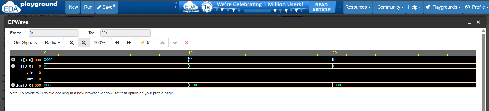
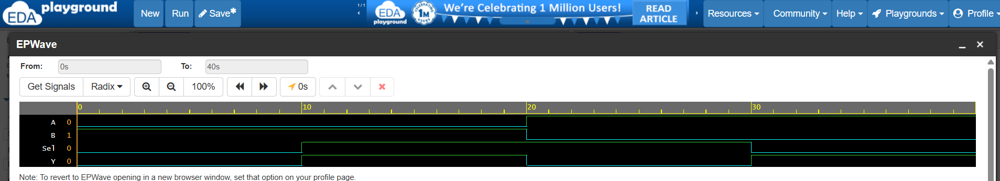
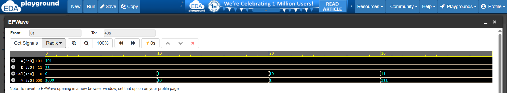
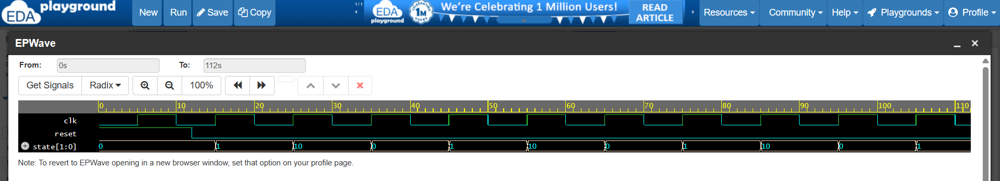
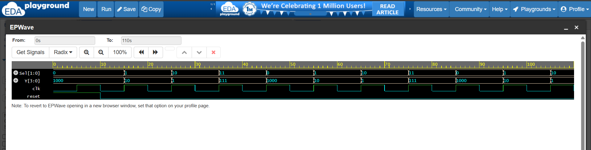

# Verilog Projects

This repository contains digital design projects implemented using Verilog HDL.
Each project includes design code, testbench, and simulation waveform.

---

## 🔹 1. 4-bit Adder

### Description

Performs binary addition of two 4-bit inputs with carry.

### Tools Used

* Verilog HDL
* EDA Playground (Icarus Verilog)

### Simulation Result

* 0011 + 0101 = 1000
* 1111 + 0001 = 0000 (Cout = 1)

---

## 🔹 2. 2:1 Multiplexer (MUX)

### Description

Selects one of two inputs based on select signal.

### Logic

* Sel = 0 → Output = A
* Sel = 1 → Output = B

### Simulation Result

Verified using waveform.

---

## 🔹 3. ALU (Arithmetic Logic Unit)

### Description

A 4-bit ALU that performs arithmetic and logical operations based on control signal.

### Operations

* 00 → Addition
* 01 → Subtraction
* 10 → AND
* 11 → OR

### Simulation Result

Verified using waveform analysis.

---

## 🔹 4. Traffic Light FSM

### Description

A finite state machine that cycles through traffic light states.

### States

* 00 → Green
* 01 → Yellow
* 10 → Red

### Simulation Result

State transitions verified using waveform.

---

## 🔹 5. Mini Project: ALU Controlled by FSM 🚀

### Description

Designed a simple digital system where an FSM controls an ALU to perform different operations automatically.

### Architecture

* FSM acts as control unit (generates Sel signal)
* ALU acts as datapath (performs operations)

### Operations

* 00 → Addition
* 01 → Subtraction
* 10 → AND
* 11 → OR

### Key Learning

* Integration of control logic and datapath
* System-level design thinking
* Clock-driven operation sequencing

---

## 🔹 Skills Demonstrated

* Verilog HDL coding
* Combinational logic design
* Sequential logic (FSM)
* Datapath and control unit integration
* Testbench development
* Simulation using EDA Playground
* Waveform analysis and debugging

---

## 🔹 Learning Outcome

* Built and verified digital circuits using Verilog
* Understood FSM design and timing behavior
* Gained experience in debugging simulation issues
* Learned how real digital systems combine modules

---

## 🔹 Future Work

* Parameterized designs
* Counters and registers
* Advanced system design (processor-level projects)

---

## 🔹 Author

**Iniyatamil K**

---

